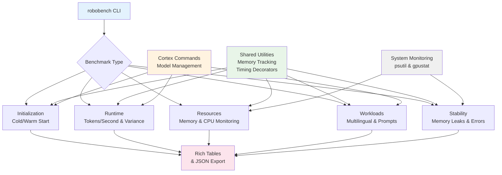

At the beginning of 2025, I joined Menlo Research (formerly HomeBrew Labs) as a research engineer
and had the chance to work on a few cool projects, `robobench` being one of them. The timing was
particularly interesting as Large Language Model deployment had become the new gold rush, with
everyone claiming they had the fastest inference, the lowest latency, or the most efficient memory
usage. The problem was, most of these claims were backed by benchmarks about as reliable as a weather
forecast in tornado season.

At Menlo, we were building yet another wrapper around llama.cpp called Cortex.cpp. This was not
for general purpose conversations with open source models but rather for using LLMs inside
hardware that could be used to control a robot. This required heavy testing on different
all the pis motherboard configurations possible, which led to my work on `robobench`: a tool
designed to measure a myriad of metrics and benchmark Cortex.cpp and llama.cpp. While Cortex was
ultimately [archived in June 2025](https://github.com/menloresearch/cortex.cpp), the benchmarking
insights and methodology behind `robobench` remain relevant for anyone serious about measuring local
LLM performance.

While most benchmarking tools focus on abstract metrics that sound impressive in marketing materials,
`robobench` takes a different approach. It measures performance characteristics that determine whether
your LLM deployment will gracefully handle common workloads or collapse like a house of cards at
the first sign of stress.

*[Placeholder: Architecture diagram showing the relationship between Cortex.cpp, llama.cpp, and robobench]*

```mermaid
%%{
  init: {
    "theme": "dark",
    "themeVariables": {
      "primaryColor": "#333333",
      "primaryTextColor": "#FFFFFF",
      "secondaryColor": "#333333",
      "secondaryTextColor": "#FFFFFF",
      "tertiaryColor": "#333333",
      "tertiaryTextColor": "#FFFFFF",
      "textColor": "#FFFFFF",
      "lineColor": "#FFFFFF"
    }
  }
}%%
graph TB
      CLI[CLI Interface<br/>cli.py] --> |typer commands| BENCH{Benchmark Type}

      BENCH --> |--type init| INIT[Model Initialization<br/>initialization.py]
      BENCH --> |--type runtime| RUNTIME[Runtime Performance<br/>runtime.py]
      BENCH --> |--type resources| RESOURCES[Resource Monitoring<br/>resources.py]
      BENCH --> |--type advanced| ADVANCED[Advanced Processing<br/>advanced.py]
      BENCH --> |--type workload| WORKLOAD[Workload Testing<br/>workloads.py]
      BENCH --> |--type quantization| QUANT[Quantization Analysis<br/>quantization.py]
      BENCH --> |--type stability| STABILITY[Stability Testing<br/>stability.py]
      BENCH --> |--type integration| INTEGRATION[Integration Testing<br/>integration.py]

      INIT --> |measures| COLD[Cold Start Time]
      INIT --> |measures| WARM[Warm Start Time]
      INIT --> |measures| MEM_SPIKE[Memory Spike]

      RUNTIME --> |measures| TOKENS[Tokens/Second]
      RUNTIME --> |measures| VARIANCE[Latency Variance]
      RUNTIME --> |measures| BATCH[Batch Performance]

      RESOURCES --> |monitors| CPU_USAGE[CPU Utilization]
      RESOURCES --> |monitors| MEM_GROWTH[Memory Growth]
      RESOURCES --> |monitors| GPU_METRICS[GPU Metrics]

      WORKLOAD --> |tests| MULTI_LANG[Multilingual Performance]
      WORKLOAD --> |tests| PROMPT_LEN[Prompt Length Impact]
      WORKLOAD --> |tests| SYS_PROMPT[System Prompt Overhead]

      STABILITY --> |detects| MEM_LEAK[Memory Leaks]
      STABILITY --> |detects| THERMAL[Thermal Throttling]
      STABILITY --> |tracks| ERROR_RATE[Error Patterns]

      CLI --> |reset environment| CORTEX_ENV[Cortex Environment<br/>cortex stop/start]

      CORTEX_ENV --> |runs| CORTEX_CMD[cortex run -d model_name]
      CORTEX_CMD --> |wraps| LLAMA_CPP[llama.cpp engine]

      UTILS[utils.py<br/>- MemorySnapshot<br/>- measure_time decorator<br/>- get_memory_usage] --> |shared by| INIT
      UTILS --> |shared by| RUNTIME
      UTILS --> |shared by| RESOURCES
      UTILS --> |shared by| WORKLOAD
      UTILS --> |shared by| STABILITY

      CLI --> |outputs| TABLES[Rich Tables<br/>Performance Metrics]
      CLI --> |outputs| JSON_EXPORT[JSON Results<br/>--json flag]

      style CLI fill:#e1f5fe,color:#000
      style CORTEX_CMD fill:#fff3e0,color:#000
      style LLAMA_CPP fill:#f3e5f5,color:#000
      style UTILS fill:#e8f5e8,color:#000
      style TABLES fill:#fce4ec,color:#000
      style JSON_EXPORT fill:#fce4ec,color:#000
```




## What was getting measured

During my time working on this project in early 2025, `robobench` focused specifically on Cortex.cpp, which
was Menlo's ambitious attempt to create "the brain of robots." The benchmarking challenge was incredibly
interesting as Cortex.cpp was essentially an elegant wrapper around llama.cpp but with a Docker-inspired CLI,
integrated OpenAI-compatible API with [Scalar docs](https://scalar.com/), and other niceties. This challenge entailed
measuring the entire stack—not just raw llama.cpp performance, but also the impact of the orchestration layer
that makes running models practical (i.e., pulling, running, switching, and tweaking models).

When you run `robobench "llama3.2:3b-gguf-q2-k" --type init`, the tool measures that loading this 3GB model
spikes memory by 4.2GB (the difference between peak and initial), takes 12.3 seconds cold versus 2.1 seconds
warm, and reveals that your "fast" SSD is actually the bottleneck at 180MB/s sustained read. These aren't theoretical
numbers—they're measurements of what your hardware actually does when asked to wake up artificial intelligence.

The tool recognized that measuring wrapper performance is more valuable than measuring engine performance. When
robobench executed `cortex run -d model_name` via the `subprocess` module, it captured the full pipeline from
docker-style orchestration overhead, API server startup time, model file parsing, memory allocation patterns,
and the eventual llama.cpp inference, all wrapped in our vision of AI-powered robotics.

What began as tooling for an ambitious robotics platform proved that the metrics which matter for a robot's
"brain" are the same ones that matter for any serious local development or production use. The performance
measurement principles remain just as relevant for any local LLM infrastructure, whether it's running on a robot or a server.

## Architecture

The codebase is organized into distinct benchmarking modules, each targeting a specific aspect of LLM
performance. This modular approach means you can pick and choose the metrics that matter most for your use case,
rather than drowning in a sea of irrelevant info/metadata that can take time to process (e.g., running benchmarks
on a >14B model will take much longer than on a smaller model).

```sh
src/robobench/core/
├── advanced.py
├── initialization.py
├── integration.py
├── quantization.py
├── resources.py
├── runtime.py
├── stability.py
├── utils.py
└── workloads.py
```



### Model Loading

The `ModelInitializationBenchmark` class in `src/robobench/core/initialization.py` measures what happens when you load
a model from RAM.

```python
@measure_time
def _cold_start(self) -> Dict[str, Any]:
    """Perform cold start by stopping and starting the model"""
    self._run_cortex_command(["cortex", "stop"])
    initial_memory = get_memory_usage()
    result = self._run_cortex_command(["cortex", "run", "-d", self.model_name])
    mem_usage = get_memory_usage()
    return {
        "initial_memory": initial_memory,
        "peak_memory": mem_usage,
        "result": result
    }
```

The cold start measurement is particularly revealing because it captures the full model loading pipeline: reading the GGUF file from disk, allocating memory buffers, initializing the computational graph, and warming up the inference engine. The warm start measurement, by contrast, measures how quickly the system can reload an already-cached model.

What makes this genuinely useful is the memory spike calculation (`memory_spike = peak_memory.ram_used - initial_memory.ram_used`). When you see that loading llama3.2:3b requires 4.2GB of RAM despite being a 3GB model file, you're learning that your deployment needs to account for temporary buffers, initialization overhead, and memory fragmentation. This is why containers running "3GB models" crash with "out of memory" errors on 4GB systems.

*[Placeholder: Video showing robobench initialization benchmark running with memory usage visualization]*

### Runtime Performance: Beyond Tokens Per Second

The `RuntimeBenchmark` class demonstrates sophisticated understanding of what actually affects inference performance. Rather than just measuring raw token throughput, it captures metrics that impact real-world usage:

```python
def _measure_streaming_performance(self) -> tuple[float, float]:
    """Measure streaming performance with variance calculation"""
    tokens = []
    start_time = time.perf_counter()
    # ... process streaming tokens ...
    variance = statistics.variance(token_times) if len(token_times) > 1 else 0.0
    return total_tokens / total_time, variance
```

The variance calculation is where this gets interesting. Most benchmarks report average tokens per second, which is about as useful as knowing the average temperature in a volcano. When robobench shows "12.5 ±3.2 tokens/second," that ±3.2 tells you whether users will get consistent streaming or whether they'll experience the infamous "fast-slow-fast-slow" pattern that makes chat interfaces feel broken. A model that averages 15 t/s but varies from 5-25 t/s provides a worse user experience than one that consistently delivers 12 t/s.

The batch performance measurement (`_measure_batch_performance`) deserves special attention. It spawns concurrent processes to simulate real-world load patterns, measuring how performance scales (or degrades) with concurrent requests. This is the kind of measurement that reveals whether your deployment can handle multiple users or if adding a second user will crater your performance.

### Memory Management: The Elephant in the Room

The `ResourceBenchmark` class in `src/robobench/core/resources.py` monitors system resources during model execution. This might sound mundane, but it's where most deployments fail spectacularly:

```python
def _monitor_memory(self) -> tuple[List[MemorySnapshot], float]:
    """Monitor memory usage over time and calculate growth rate"""
    snapshots = []
    start_time = time.time()
    while time.time() - start_time < self.duration:
        snapshot = get_memory_usage()
        snapshots.append(snapshot)
        time.sleep(self.sampling_interval)
    # Calculate memory growth rate
    memory_growth = (snapshots[-1].ram_used - snapshots[0].ram_used)
    growth_rate = memory_growth / self.duration
    return snapshots, growth_rate
```

The memory growth rate calculation catches problems that only surface in production. A model might benchmark beautifully at 2.1GB memory usage, but if it grows by 50MB/hour due to a subtle KV cache bug, your "stable" deployment will crash after running for two days. This is why robobench runs extended monitoring—because the most expensive bugs are the ones that only appear after your demo is over.

*[Placeholder: Graph showing memory usage over time during extended benchmark run]*

## Workload-Specific Testing: Beyond Hello World

The `WorkloadBenchmark` class acknowledges that not all prompts are created equal. It tests performance across different prompt lengths and content types:

```python
"multilingual": {
    "en": "Describe a beautiful sunset.",
    "es": "Describe una puesta de sol hermosa.",
    "fr": "Décrivez un beau coucher de soleil.",
    "de": "Beschreiben Sie einen schönen Sonnenuntergang."
}
```

This multilingual testing reveals crucial performance variations. English might tokenize to 8 tokens per prompt, while the German equivalent becomes 12 tokens, and Chinese could hit 15 tokens. When your "fast" English benchmark shows 15 t/s, but your actual users speak German and experience what feels like 11 t/s, you've discovered why international deployments often feel sluggish despite passing all your tests.

The system prompt overhead measurement is another thoughtful touch. Many applications rely heavily on system prompts for context, but few measure the performance impact. This benchmark quantifies exactly how much your carefully crafted system prompt is costing you in latency.

*[Placeholder: Comparison chart showing performance across different languages and prompt types]*

## Stability Testing: The Long Game

The `StabilityBenchmark` class tackles the question that keeps system administrators awake at night: will this thing still work tomorrow? The implementation monitors performance degradation over extended periods:

```python
def _detect_memory_leak(self, snapshots: List[MemorySnapshot]) -> Tuple[bool, float]:
    """Analyze memory pattern to detect leaks"""
    growth_rate = (memory_values[-1] - memory_values[0]) / time_hours
    baseline_memory = memory_values[0]
    is_leak = growth_rate > (baseline_memory * 0.1)
    return is_leak, growth_rate
```

The leak detection algorithm is elegantly simple: if memory grows by more than 10% of baseline per hour, something is probably wrong. This catches the slow leaks that only become apparent during extended operation.

The thermal throttling detection is particularly relevant for edge deployments where cooling might be limited. The benchmark monitors GPU temperature and correlates it with performance degradation, giving you data about thermal limits before they become production problems.

*[Placeholder: Video showing stability benchmark detecting memory leak over time]*

## Command Line Interface: Thoughtfully Designed

The CLI interface reveals careful consideration of real-world usage patterns. Rather than requiring users to specify dozens of parameters, it provides sensible defaults while allowing customization where it matters:

```bash
# Simple usage for quick assessment
robobench "llama3.2:3b-gguf-q2-k"

# Comprehensive analysis with custom parameters
robobench "llama3.2:3b-gguf-q2-k" \
    --type all \
    --users 50 \
    --duration 300 \
    --stability-duration 2 \
    --json results.json
```

The JSON export functionality is crucial for automated testing pipelines. The structured output makes it possible to integrate robobench into CI/CD systems or performance monitoring dashboards.

*[Placeholder: Terminal recording showing various robobench commands and their outputs]*

## The Quantization Reality Check

One of robobench's most valuable contributions is its honest assessment of quantization trade-offs. The `QuantizationBenchmark` measures not just the memory savings from quantization, but the actual performance and accuracy implications:

```python
@dataclass
class QuantizationMetrics:
    compression_ratio: float
    inference_speed: float
    accuracy_score: float
    relative_quality: float
    numerical_stability: float
```

The numerical stability measurement is particularly important. Quantization can introduce subtle numerical errors that accumulate over long sequences, leading to degraded output quality that might not be apparent in short benchmarks. Most tools ignore this entirely, leaving users to discover the problem in production.

## What's Actually Being Measured

When you run robobench, you're measuring the entire stack: the Python wrapper calling Cortex.cpp, which orchestrates llama.cpp, which executes optimized kernels on your hardware. This full-stack measurement approach provides results that reflect real deployment conditions rather than theoretical maximums.

The tool accounts for the overhead at each layer. When it measures "model loading time," it includes the time Cortex spends parsing your model specification, locating the GGUF file, and initializing the llama.cpp context. This overhead might seem trivial in isolation, but it accumulates in real-world usage patterns.

*[Placeholder: Meme showing "Benchmarks vs Reality" with exaggerated performance claims vs actual measured results]*

## Integration Testing: The Network Effect

The `IntegrationBenchmark` class tests the HTTP/WebSocket interfaces that most applications actually use. This is where many deployments encounter their first unpleasant surprise: perfect local performance that degrades significantly when accessed over a network.

The WebSocket streaming stability measurement is particularly valuable for chat applications. It measures not just whether streaming works, but whether it works reliably under concurrent load with realistic network conditions.

## Memory Management: The Elephant in the Room

robobench's memory monitoring goes beyond simple usage measurements. It tracks memory fragmentation, growth patterns, and GPU memory allocation across the entire benchmark suite. This reveals issues that only become apparent during extended operation with realistic workloads.

The GPU memory sharing metrics in the advanced benchmarks show how efficiently memory is utilized when running multiple models or concurrent requests. This is crucial for understanding the practical limits of your hardware configuration.

*[Placeholder: AI-generated image showing a computer struggling under the weight of multiple AI models]*

## Lessons from an Ambitious Project

Looking back at the original roadmap, robobench was intended to support Cortex's evolution into a comprehensive robotics AI platform. The plans included framework-agnostic benchmarking, UI and local server functionality, and integration with a broader ecosystem of AI deployment tools. While Cortex's archival meant these specific integrations never materialized, the core insight remains valuable: robust benchmarking is essential regardless of the deployment framework.

The principles I developed for robotics applications—measuring stability under sustained load, detecting memory leaks during extended operation, quantifying thermal impacts on performance—translate directly to any scenario where AI systems need to work reliably in production environments. Whether you're deploying to a robot or a server, the fundamental challenges of resource management and performance consistency remain the same.

## The Bottom Line

robobench represents a mature approach to LLM benchmarking that prioritizes practical utility over impressive numbers. Developed during my time at Menlo Research for the ambitious but ultimately short-lived Cortex project, it measures what actually matters for deployment success: stability under load, resource utilization patterns, and real-world performance characteristics.

The tool was born from the practical needs of robotics deployment, where performance isn't just about impressing benchmarks—it's about whether a robot can reliably process sensor data, make decisions, and act in the real world without crashing or consuming all available resources. These requirements led to a refreshingly honest approach to measurement that remains valuable even as the robotics vision evolved.

In an ecosystem filled with benchmarks that optimize for marketing appeal rather than operational insight, robobench takes the approach of measuring what you'll actually encounter when you deploy these models in production. The metrics it provides won't necessarily make your model look faster, but they will make your deployment more reliable—a lesson learned from the practical demands of trying to put AI into actual hardware.

*[Placeholder: Video montage showing successful deployment scenarios enabled by comprehensive benchmarking]*

While Cortex may not have achieved its vision of becoming "the brain of robots," the performance measurement principles I developed remain relevant for anyone serious about local LLM deployment. The benchmarking methodology that was designed for robotics applications translates remarkably well to any scenario where reliability matters more than vanity metrics.

---

*The project may be archived, but the insights live on. Sometimes the most valuable lessons come from ambitious projects that teach us what really matters in the unglamorous work of making AI actually work in the real world.*

```bash
pipx install robobench
robobench "your-model:quantization" --type all --verbose
```

*Warning: Results may contain actual performance data rather than optimistic projections.*
